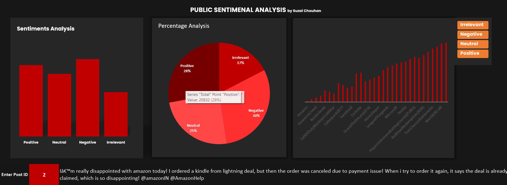

# 📊 Social Media Sentiment Analysis Dashboard (Excel)

This project is a clean, interactive **Excel Dashboard** built to analyze and visualize sentiment patterns from social media data. The dataset includes thousands of posts labeled with sentiments like **Positive**, **Negative**, and **Neutral** — and the dashboard provides deep insights into public opinion towards various topics and brands.

---

## 📁 Files Included

- `Sentiment_Dashboard.xlsx` – Fully interactive Excel workbook containing:
  - Cleaned tweet data
  - PivotTables for analysis
  - Dashboard sheet with dynamic slicers and charts
  - Post ID search functionality using XLOOKUP
- `twitter_training.csv` – Raw training dataset
- `README.md` – Project documentation

---

## 🔍 Key Features

- 📌 Sentiment Distribution Overview (Pie Chart)
- 📌 Sentiment per Brand/Topic (Bar + Stacked Bar)
- 📌 Word Clouds (Optional via external tool)
- 📌 Interactive Slicers (filter by sentiment or topic)
- 📌 Post ID Search (Instant tweet lookup)
- 📌 Clean UI with background layout for professional look

---

## 📷 Dashboard Preview

> ✅ Replace this image below with an actual screenshot of your Excel dashboard

---

## 🧠 Insights Derived

- Most frequent sentiments across topics
- Most positively or negatively discussed brands
- Public opinion trends based on tweet content
- Helps companies track reputation and user emotion

---

## 📊 Tools Used

- Microsoft Excel (PivotTables, Charts, Power Query)
- Optional: Python (for advanced word cloud / text cleaning)
- Optional: WordArt.com (for word cloud visualization)

---

🤝 Acknowledgements
Dataset provided by Prodigy Internship Program (Kaggle Dataset) 
Inspired by real-world applications of brand sentiment tracking

📬 Contact
Created by Suzal Chouhan
📧 Email: unofficial.suzal@gmail.com
